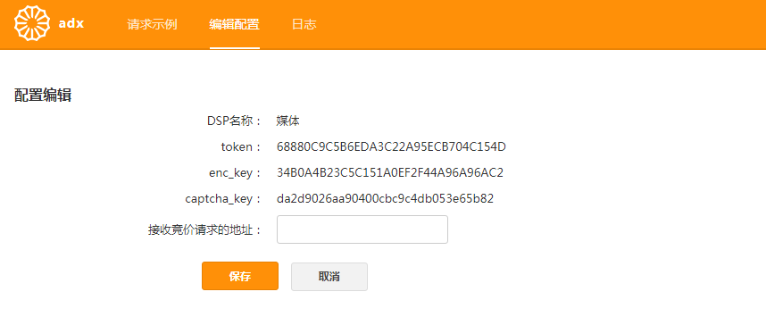
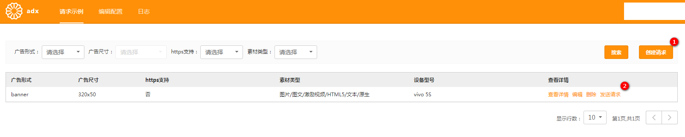
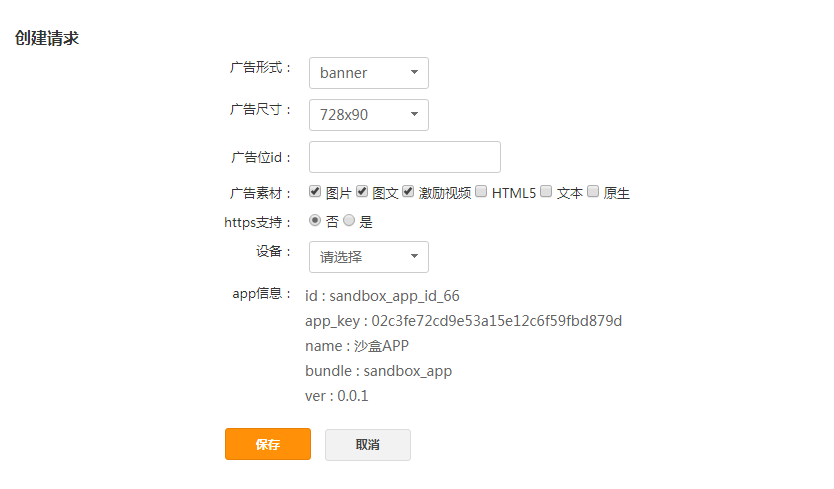

# How to use sandbox

The sandbox is the virtual environment to be used to test if you integrate the API successfully.

The URL:
http://sandbox.dspcp.adx.yumimobi.com

The credential is same with your official credential.

## Instructions

1. Add the request URL

   

2. Create a request

   

   Click the button "创建请求"

   

   Set the values for slot type("广告形式"), size("广告尺寸"), slot id("广告位 id"), material type("广告素材"), whether needs https("https 支持") and device type("设备") on above page.

   _understanding of Chinese words_

   | words in Chinese | meaning in English |
   | ---------------- | ------------------ |
   | 图片             | image              |
   | 图文             | image and text     |
   | 激励视频         | video              |
   | 文本             | text               |
   | 原生             | native             |

3. send a request

   

   Click the "发送请求" to start to test.

## Note

1. The logic about how to judge the slot type in request

   The slot type is rewarded video as long as there has video object in request or is native as long as there has native object in request.

   If not, the slot type depends on the parameter instl that is in imp object. If the instl and IsSplashScreen are both true, the slot type is splash; if the instl is true and IsSplashScreen is false, th slot type is interstitial.

   if instl is false, the slot type is banner.

2. It is normal that some of extension parameters are not shown on sandbox.
