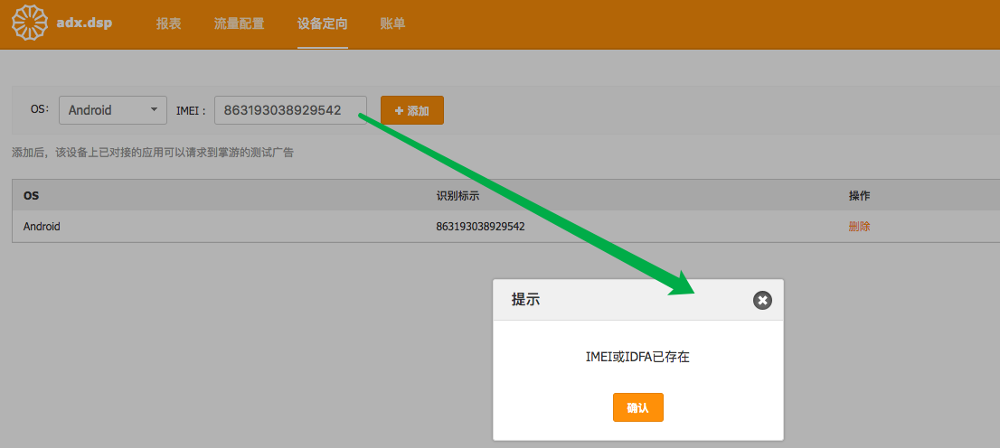
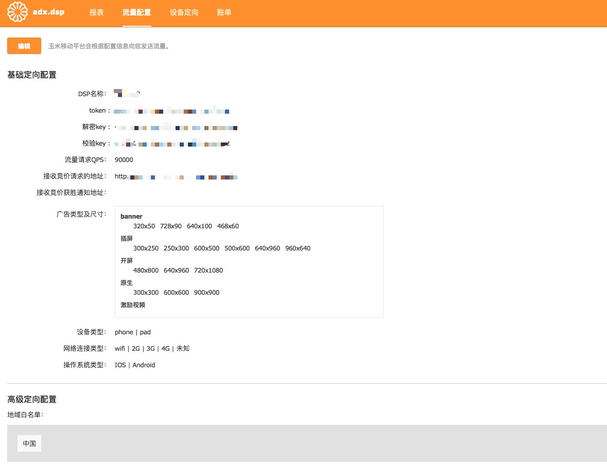

### DSP面板使用说明

#### 面板访问地址：  

http://dspcp.adx.yumimobi.com/

#### 添加设备定向以确定广告展示是否正常

如果您想预览或者检查广告投放的渲染效果，请使用该功能。

> 如果输入的IMEI或IDFA已存在，则不会添加成功。
> 单个dsp最多可设置5条定向设置！
> 添加或者删除定向，需要大约1分钟后生效。

#### 设置流量配置，自定义流量需求

您可以在流量配置中自定义自己的流量需求，您可以从广告类型及尺寸、设备类型、网络连接类型、操作系统类型及地域等方面自定义您的流量需求。

